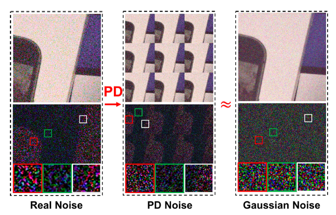
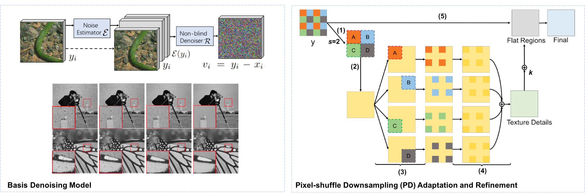
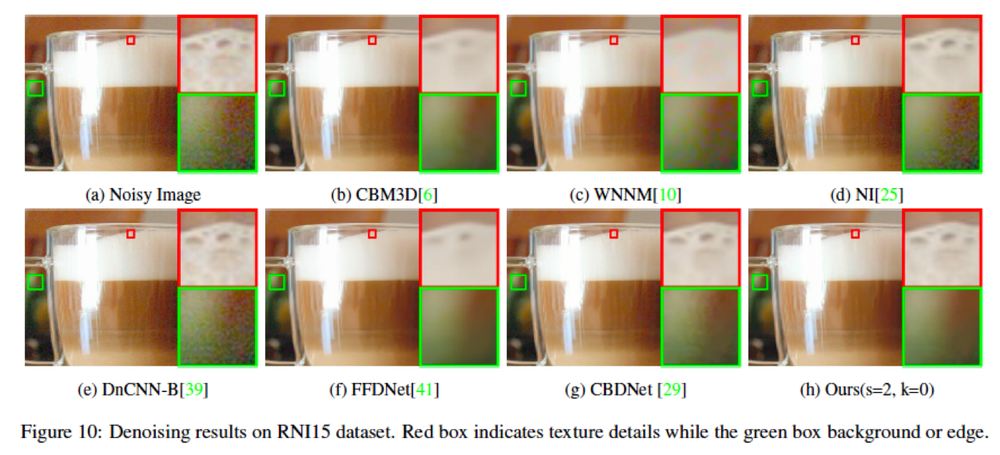
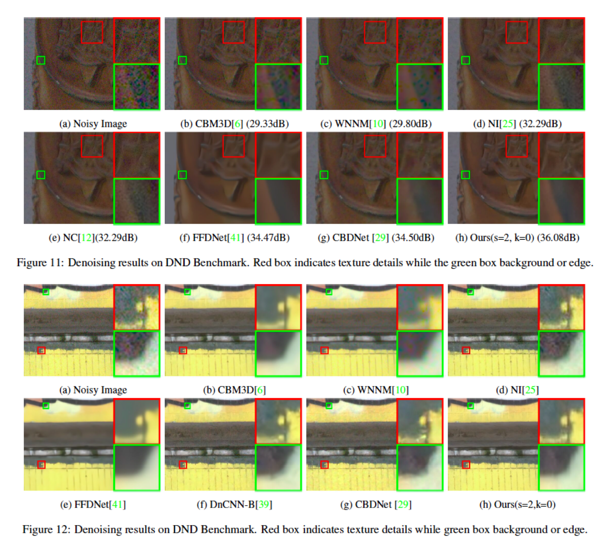
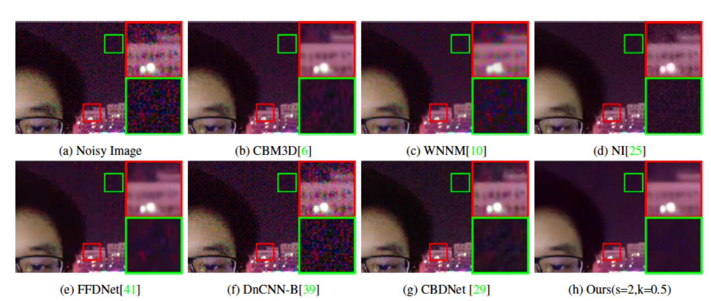
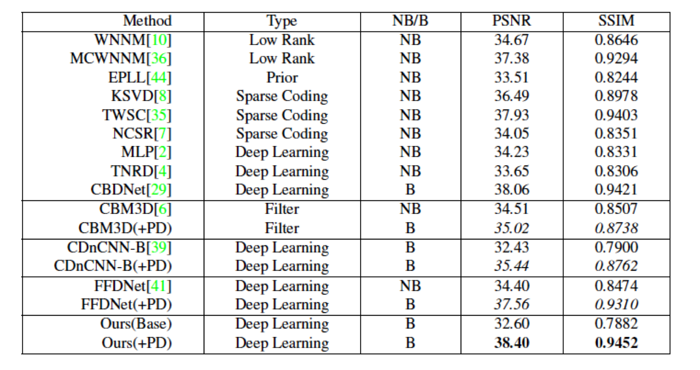

<br><br><br>

# PD-Denoising
### [PyTorch](https://github.com/yzhouas/PD-Denoising-pytorch) |[Tech Report](https://arxiv.org/abs/1904.03485)
This is the official pytorch implementation of the paper 'When AWGN-based Denoiser Meets Real Noises', and parts of the code are initialized from the pytorch implementation of [DnCNN-pytorch](https://github.com/SaoYan/DnCNN-PyTorch). We revised the basis model structure and data generation process, and rewrote the testing procedure to make it work for real noisy images. More details can be found in the code implementation.

## Abstract
Discriminative learning based image denoisers have achieved promising performance on synthetic noise such as the additive Gaussian noise. However, their performance on images with real noise is often not satisfactory. The main reason is that real noises are mostly spatially/channel-correlated and spatial/channel-variant. In contrast, the synthetic Additive White Gaussian Noise (AWGN) adopted in most previous work is pixel-independent. In this paper, we propose a novel approach to boost the performance of a real image denoiser which is trained only with synthetic pixel-independent noise data. First, we train a deep model that consists of a noise estimator and a denoiser with mixed AWGN and Random Value Impulse Noise (RVIN). We then investigate Pixel-shuffle Down-sampling (PD) strategy to adapt the trained model to real noises. Extensive experiments demonstrate the effectiveness and generalization ability of the proposed approach. Notably, our method achieves state-of-the-art performance on real sRGB images in the DND benchmark. 

## Basis Model + PD Adaptation


### Basis Model
The proposed blind denoising model G consists of a noise estimator E and a follow-up non-blind denoiser R. It is trained on AWGN and RVIN. It can achieve the disentanglement of the two noises as shown.

### PD Adaptation
The proposed Pixel-shuffle Down-sampling (PD) refinement strategy: (1) Compute the smallest stride s, which is 2 in this example and more CCD image cases, to match AWGN following the adaptation process, and pixel-shuffle the image into mosaic y_s; (2) Denoise y_s using G; (3) Refill each sub-image with noisy blocks separately and inversely pixel-shuffle them; (4) Denoise each refilled image again using G and average them to obtain the texture details T; (5) Combine the over-smoothed flat regions F to refine the final result. 

## Denoising Performance on Real Images
### RNI15


### DND Benchmark


### Self-collected Night Photos


## Comparisons with state-of-the-arts
We follow the submission guideline of DND benchmark to achieve the following results.


## Requirements and Dependencies
* [PyTorch](http://pytorch.org/)
* [torchvision](https://github.com/pytorch/vision)
* [tensorboardX](https://github.com/lanpa/tensorboard-pytorch) 
* OpenCV
* [HDF5 for Python](http://www.h5py.org/)

## Citation
If you think our model and code useful, please cite
```
@article{zhou2019awgn,
  title={When AWGN-based Denoiser Meets Real Noises},
  author={Zhou, Yuqian and Jiao, Jianbo and Huang, Haibin and Wang, Yang and Wang, Jue and Shi, Honghui and Huang, Thomas},
  journal={arXiv preprint arXiv:1904.03485},
  year={2019}
}
```

## Train
### Data Preparation
* Please follow [DnCNN-pytorch](https://github.com/SaoYan/DnCNN-PyTorch) to generate training data of gray image model. 
* For color images, you can save your images inside the train_c folder and process it to train_c.h5 by setting preprocess=1. In the paper, we used CBSD(500-68) as the training data set. Training data can be downloaded [here](http://web.archive.org/web/20160306133802/http://www.eecs.berkeley.edu/Research/Projects/CS/vision/grouping/resources.html#bsds500)
* If you've already built the training and validation dataset (i.e. train.h5 & val.h5 files), set *preprocess* to be False.

### Train the Baseline Model
The baseline model is the one without explicit noise estimation. We directly trained the model with AWGN, RVIN and mixed-AWGN-RVIN.
```
python train.py \
  --preprocess 1\
  --num_of_layers 20\
  --mode B\
  --color 0\
  --outf logs/baseline_model
```
### Train the Basis Model with Noise Estimation
```
python train.py \
  --preprocess 1\
  --num_of_layers 20 \
  --mode MC\
  --color 0\
  --outf logs/gray_MC_model
```
You can also directly run
```
bash run_train.sh
```
**NOTE**
* For color version, directly set the color option to 1, and change the output folder name.
* The layer number of estimation model is default 3.


### Test the Pretrained Model on Patches
We provide the pretrained model saved in the logs folder. 
To replicate the denoising results on real images in DND benchmark and other real images, simply run
```
python test.py\
 --scale 1\
 --ps 2 --ps_scale 2\
 --real 1\
 --k 0\
 --mode MC\
 --color 1\
 --output_map 0\
 --zeroout 0 --keep_ind 0\
 --num_of_layers 20\
 --delog logs/logs_color_MC_AWGN_RVIN\
 --cond 1 --refine 0 --refine_opt 1\
 --test_data real_night\
 --out_dir results/real_night
```
or simiply run,
```
bash run_test_on_real_patches.sh
```

**NOTE**
* test_data can be changed to other folder name with your own data.
* ps can be set to 1 to get the adaptive pixel-shuffle stride (ps_scale is computed by algorithm in this case). For CCD camera images, it is better to set ps=2(meaning manually setting the ps_scale) and ps_scale=2.
* k can be interactively adjusted to balance the details and background, providing a flexibile denoising performance. k=1 for more focusing on flat regions to get a very smoothed results, and k=0 for obtaining more textural details (default). 
* Testing on patch will ensure there is no boundary artifacts, but may cause out-of-memory issues on GPU while testing it on large-scale images.

### Test the Pretrained Model on Full-image
For large-scale testing images (>1k), simply run
```
python Demo_on_full_image.py\
 --scale 1\
 --wbin 512\
 --ps 2 --ps_scale 2\
 --real 1\
 --k 0\
 --mode MC\
 --color 1\
 --output_map 0\
 --zeroout 0 --keep_ind 0\
 --num_of_layers 20\
 --delog logs/logs_color_MC_AWGN_RVIN\
 --cond 1 --refine 0 --refine_opt 1\
 --test_data beijing\
 --out_dir results/beijing
```
or simiply run,
```
bash run_test_on_full_images.sh
```

**NOTE**
* test_data can be changed to other folder name with your own data.
* ps can be set to 1 to get the adaptive pixel-shuffle stride (ps_scale is computed by algorithm in this case). For CCD camera images, it is better to set ps=2(meaning manually setting the ps_scale) and ps_scale=2.
* k can be interactively adjusted to balance the details and background, providing a flexibile denoising performance. k=1 for more focusing on flat regions to get a very smoothed results, and k=0 for obtaining more textural details (default). 
* wbin is the cropped window size for denoising (defaultly set to 512). One can adjust this value to 300 or 256 to ensure there is no out-of-memory issues. But it will both decrease the efficiency and may cause boundary artifacts. 
* To ensure the uniform effect of the whole images, we assume all the patches share the same denoisng settings.
* We provide the self-collected beijing dataset for evaluation.

### Embeded PD idea to Existing Denoisers
PD methods can be embedded into other deep learning based AWGN-trained denoiser, or other traditional denoising methds. It will further improve the performance of them. The codes (pytorch and matlab) will be released soon.


## Acknowledgments
Code borrows from [DnCNN-pytorch](https://github.com/SaoYan/DnCNN-PyTorch).

